### main

1. Application est opérationnelle.
- Démarrer le backend  : $ java -jar build/libs/microcrm-0.0.1-SNAPSHOT.jar
- Démarrer le frontend : $ npx @angular/cli serve
- http://localhost:4200/  : 

2. Analyse du fichier Dockerfile d'origine :
  - Trois images :
      - orion-microcrm-front : Linux Debian 12, Node.js version 22, Caddy + ressource Angular html
      - orion-microcrm-back  : Linux Ubuntu 22.04, Gradle 8.7, Java + ressource Spring-boot app.jar
      - orion-microcrm-standalone : images de front et back + supervisor  
      => Conclusion : Il y a une erreur ( EXPOSE 4200 pour le back)
  - Front conteneur:
      - docker build --target front -t orion-microcrm-front:latest .
      - docker run -it --rm -p 80:80 -p 443:443 orion-microcrm-front:latest
       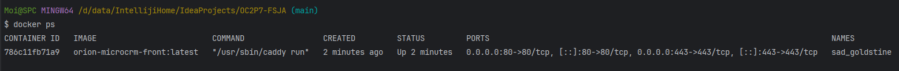  
  - Back conteneur:
      - docker build --target back -t orion-microcrm-back:latest .
      - docker run -it --rm -p 8080:8080 orion-microcrm-back:latest
        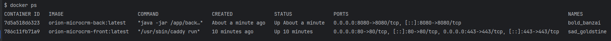
  - Standalone conteneur:
      - docker build --target standalone -t orion-microcrm-standalone:latest .
      - docker run -it --rm -p 8080:8080 -p 80:80 -p 443:443 orion-microcrm-standalone:latest
      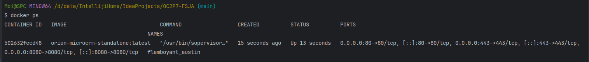

### develop
1. Refonte du fichier Dockerfile origine :
    - Correction des erreurs :  
      - gradlew contenant symbole Control-M   
      - Ports EXPOSE  
    - Remplacer : Serveur web Caddy par Nginx  

2. Démarrage des nouveaux conteneurs
   - Front :
     - $ docker build --target front -t microcrm-front .
     - $ docker run -it --rm -p 80:80 microcrm-front:latest
   - Back :
     - docker build --target back -t microcrm-back:latest .
     - docker run -it --rm -p 8080:8080 microcrm-back:latest
     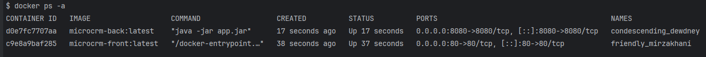
   - Standalone 
     - docker build --target standalone -t microcrm-standalone:latest .
     - docker run -it --rm -p 8080:8080 -p 80:80  microcrm-standalone:latest  
     

3. Implémentation docker-compose.yml : Splitter le Dockerfile de refonte en deux Back et Front
   - Back image : back/Dockerfile , back/.dockerignore
   - Front image : front/Dockerfile , front/.dockerignore
   - Compose Docker : docker-compose.yml
     - $ docker compose up --build
     - $ docker compose ps :  
       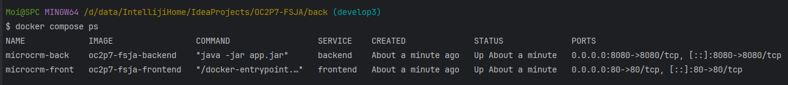

4. Implémentation Pipeline CI dans Github Action :  
   - phase 1 : Intégrer images Docker front et back dans le CI
      - Pipeline CI opérationnel dans GitHub Actions :  
        
      - Les tests existants sont exécutés automatiquement :   
      backend :     
            
      frontend :    
        
   - phase 2 : Intégrer SonarCloud dans le CI :  
      - Pipeline CI finale   
          
      - Intégration SonarCloud dans CI avec succès  
        
      - https://sonarcloud.io :  
        

5. Implémentation pipeline CD  
   - Refactor : ci.yml  
     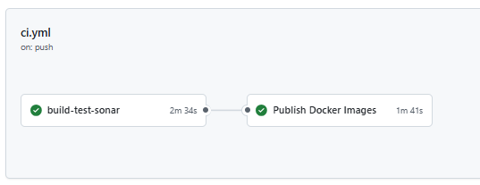  
   - Publication CD dans Docker Hub :  
     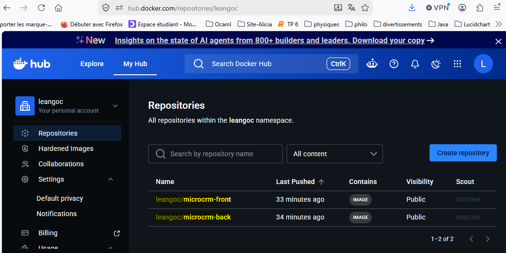  

### Exercice 2 

6. Implémentation ELK
   - docker compose -f docker-compose-elk.yml up -d
     docker ps -a  
     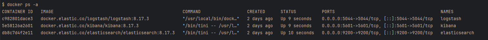

   - Elasticsearch : http://localhost:9200  
     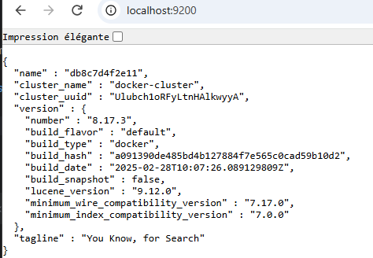      

   - Kibana : http://localhost:5601  
     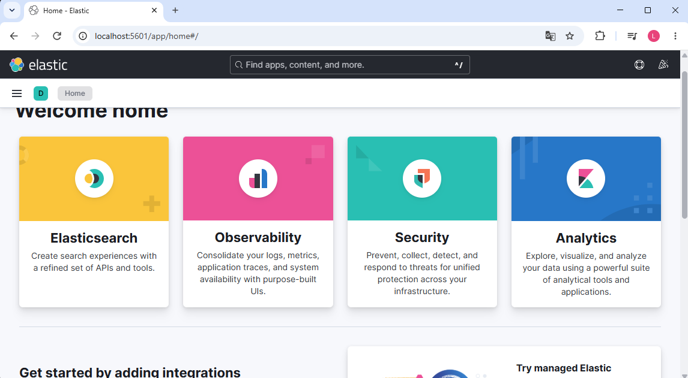  
   
7. Refactor Backend pour envoyer les logs vers ELK  
    - Implémentation : logback-spring.xml, application.properties, build.gradle
    - $ ./gradlew bootRun
    - Trace backend remontée sur Kibana
      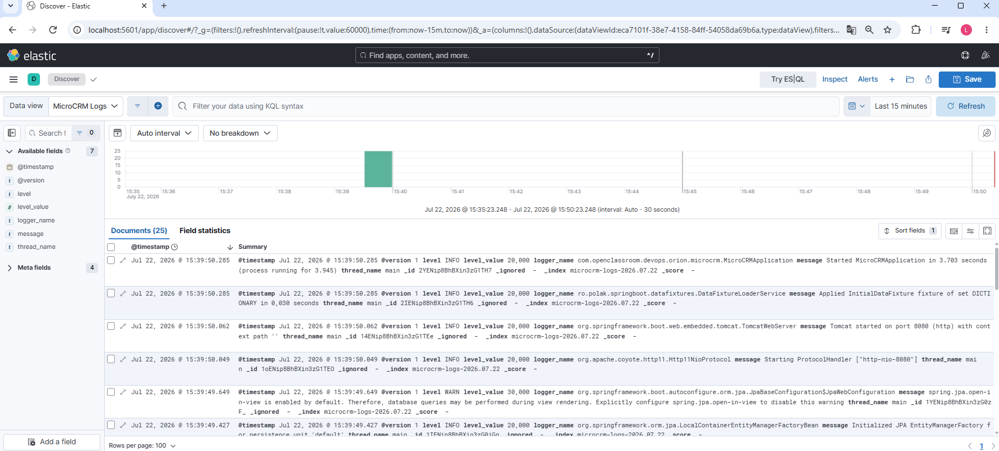  

8. Refactor Frontend pour remonter les logs vers Kibana ( via API Rest vers backend)
   - Implémentation : dto/FrontendLog.java, controller/FrontendLogController.java  
     API Post http://localhost:8080/api/logs :  
     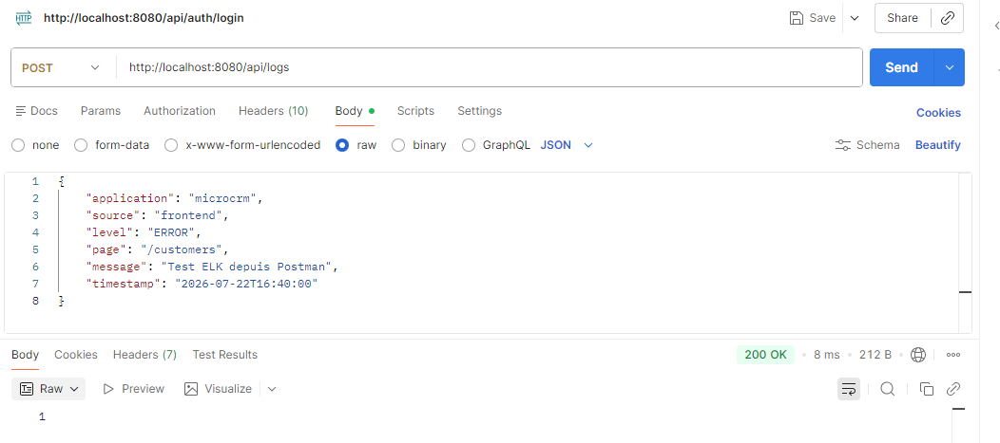  
     logs dans logstash :  
     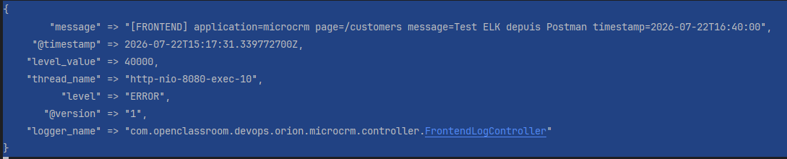  
   - implémentation logstash structurés : refactorer FrontendLogController.java  
     Avant :   
     Après : 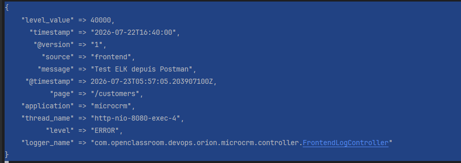  

9. Brancher le frontend ( Envoyer Api logs vers backend)
    - Implémentation : services/logging.service.ts, app.components.ts
      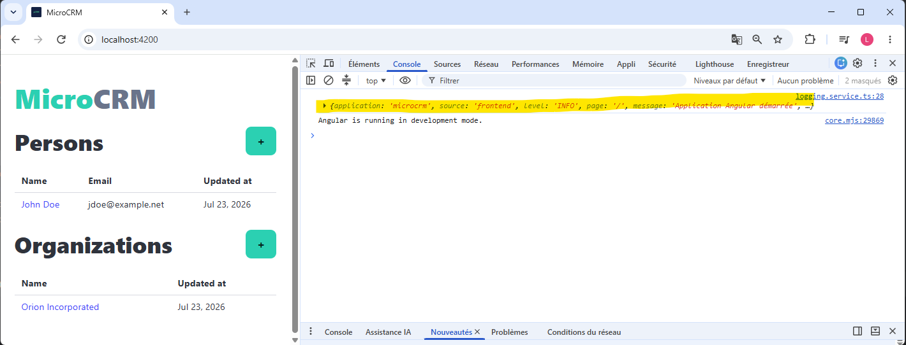  

10. Journalisation des évènements :  
    - PersonDetailsComponent  
    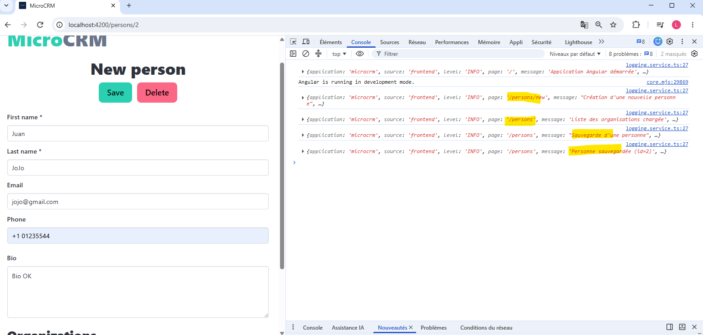  
    - OrganizationDetailsComponent     
      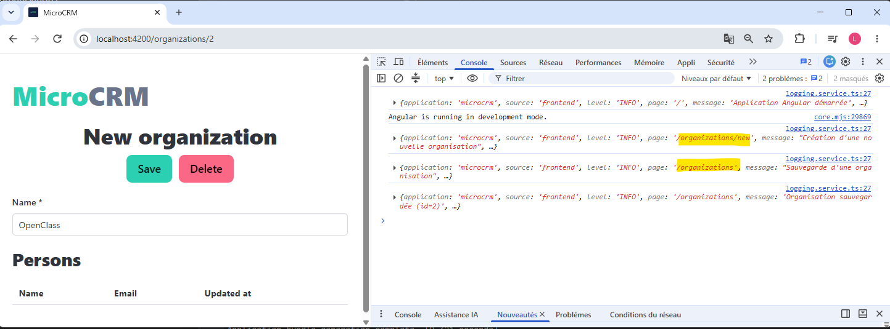 
    - Dans Logstash  
      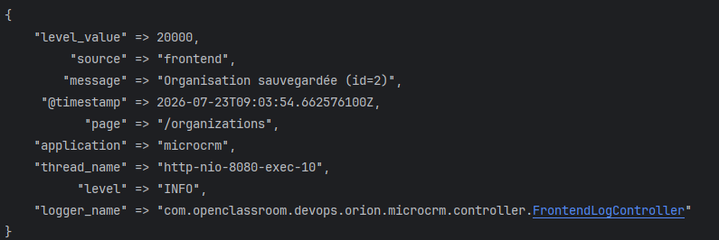  

11. Configurer Kibana visualisation   
    - Dashboard :  
    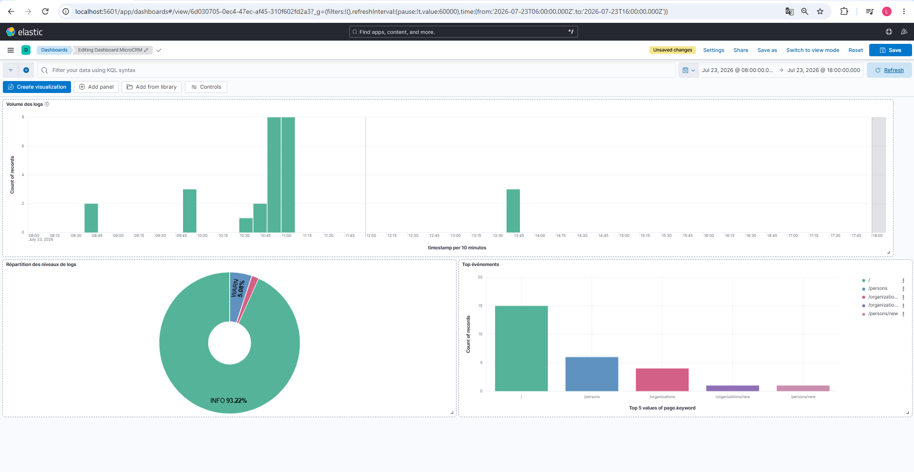