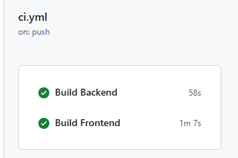
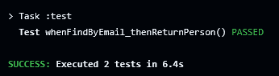
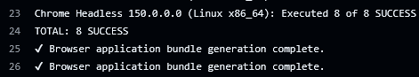
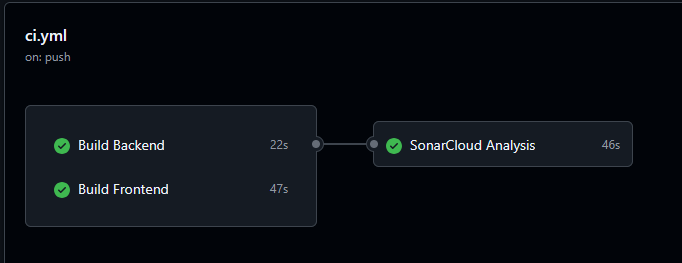
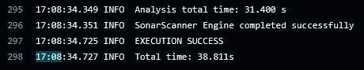
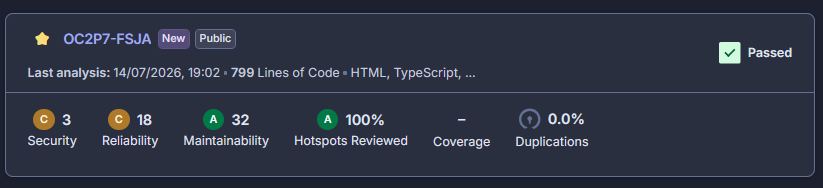

### main
1. Application est opérationnelle.
- Démarrer le backend  : $ java -jar build/libs/microcrm-0.0.1-SNAPSHOT.jar
- Démarrer le frontend : $ npx @angular/cli serve
- http://localhost:4200/  : 

### develop < main
1. Implémentation ci.yml : phase 1
   - Un pipeline CI opérationnel dans GitHub Actions :  
   - Les tests existants sont exécutés automatiquement :    
           backend    
            
  
      frontend   
        

2. refactor ci.yml: phase 2
   -  SonarCloud analysis : sonar-project.properties
      
      
      

### develop1
1. Dockerfile : back/Dockerfile , back/.dockerignore
   - Création image Docker microcrm-back : $ docker build -t microcrm-back ./back
   - $ docker images | grep micro
     > microcrm-back:latest       9526fe944064        465MB          136MB
   

### develop2
1. Dockerfile : front/Dockerfile , front/.dockerignore
- docker build -t microcrm-front ./front
- $ docker images | grep micro
  > microcrm-front:latest            59c07ac44ee2       74.1MB         21.1MB
