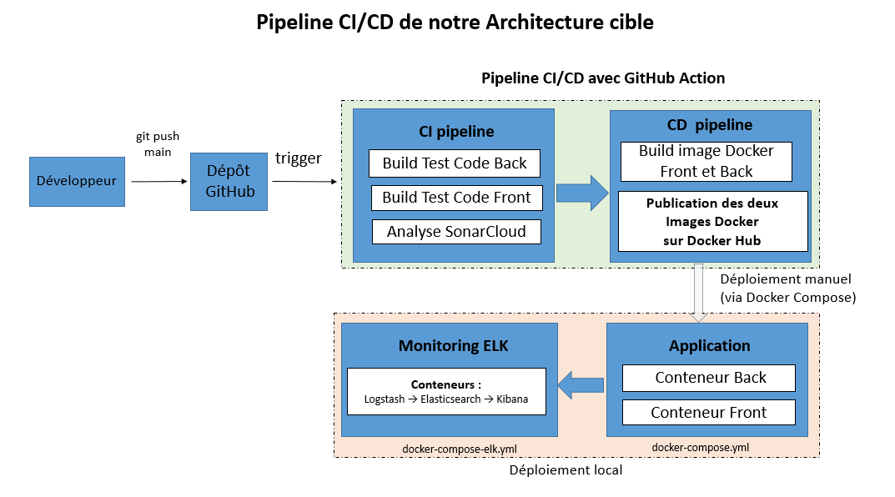

# MicroCRM – CI/CD & DevOps

## Présentation

Ce projet a été réalisé dans le cadre de la formation **Lead Développeur Java / Angular** d'OpenClassrooms.

L'objectif est de mettre en œuvre une chaîne **CI/CD complète** pour une application Full Stack, puis d'y intégrer des outils de qualité logicielle, de déploiement automatisé et de supervision.

Le projet repose sur une application **MicroCRM** composée :

- d'un frontend Angular ;
- d'un backend Spring Boot ;
- d'une base de données HSQLDB ;
- d'un pipeline GitHub Actions ;
- de Docker et Docker Hub ;
- de SonarCloud pour l'analyse statique ;
- de la stack ELK (Elasticsearch, Logstash, Kibana) pour le monitoring.

---

# Technologies utilisées

## Backend

- Java 17
- Spring Boot 3
- Gradle

## Frontend

- Angular 17
- TypeScript
- Node.js 20

## DevOps

- GitHub Actions
- Docker
- Docker Compose
- Docker Hub
- SonarCloud
- Elasticsearch
- Logstash
- Kibana

---

# Architecture



---

# Fonctionnalités mises en œuvre

- Intégration continue avec GitHub Actions
- Compilation automatique du backend
- Compilation automatique du frontend
- Exécution des tests automatisés
- Analyse de qualité avec SonarCloud
- Construction des images Docker
- Publication automatique sur Docker Hub
- Monitoring applicatif avec ELK
- Centralisation des logs frontend et backend

---

# Pipeline CI/CD

Le pipeline GitHub Actions réalise automatiquement les opérations suivantes :

1. Récupération du code source
2. Compilation du backend Spring Boot
3. Exécution des tests backend
4. Compilation du frontend Angular
5. Exécution des tests frontend
6. Analyse SonarCloud
7. Construction des images Docker
8. Publication des images sur Docker Hub

---

# Prérequis

Avant d'exécuter le projet, installer :

- Git
- Java 17
- Node.js 20
- Docker Desktop
- Docker Compose

---

# Installation

## Cloner le dépôt

```bash
git clone https://github.com/LeangOC/OC2P7-FSJA.git

cd OC2P7-FSJA
```

---

## Lancer l'application

```bash
docker compose up -d
```

---

## Vérifier les conteneurs

```bash
docker ps
```

---

# Monitoring ELK

La stack ELK peut être démarrée avec :

```bash
docker compose -f docker-compose-elk.yml up -d
```

Les services sont accessibles aux adresses suivantes :

| Service | URL |
|----------|-----|
| Elasticsearch | http://localhost:9200 |
| Kibana | http://localhost:5601 |

---


